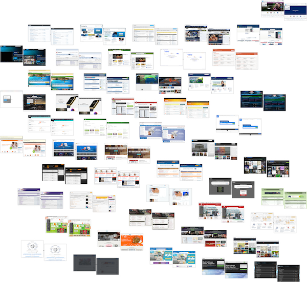

# Page Compare

This is a simple toolset for measuring the similarity of web pages.

## Quick Start

We have included a dataset to play with in `/data`, but you can also generate
your own dataset using the tools provided here. (If you want to use the
provided data, skip this step.)

Define the sites you want to scrape in a JSON file (see the included
`sites.json` as an example). Now you can run the scraper:

    $ python scrape.py
    Usage: scrape.py <splash url> <sites JSON> <run number> <output path>
    $ python scrape.py http://localhost:8050 sites.json 1 data
    ...

The `<run number>` argument is appended to the filename to help keep track of
multiple scrapes, for example you might want to scrape cnn.com today and again
tomorrow to compare the similarity of the two resulting pages. This will
populate the `data` directory with `*.html` scrapes of each site and `*.png`
thumbnails of each site.

Next, run pair-wise comparision for all `*.html` files in your dataset. (You
can use the included `data` directory to get started.)

    $ python3 compare-tags-all.py data
    data/about-1.html (1/186)
    data/about-2.html (2/186)
    data/amex-1.html (3/186)
    data/amex-2.html (4/186)
    data/answers-1.html (5/186)
    data/answers-2.html (6/186)
    data/aol-1.html (7/186)
    data/apple-1.html (8/186)
    data/apple-2.html (9/186)
    data/archlinux-1.html (10/186)

(This step is O(N^2) over the number of sites, so it can be quite slow.)

When it's done, it will output a file called `compare-tags.json` that contains
pairwise similarity values for each pair of `.html` files in the data
directory:

    [
        {
            "path1": "data/cnn-1.html",
            "path2": "data/cnn-2.html",
            "similarity": 66.2429723783916
        },
        {
            "path1": "data/cnn-1.html",
            "path2": "data/comcast-1.html",
            "similarity": 2.2954091816367264
        },
        {
            "path1": "data/cnn-1.html",
            "path2": "data/comcast-2.html",
            "similarity": 1.226215644820296
        },
        ...
    ]

The similarity values are real numbers between 0.0 and 100.0, inclusive, where
0.0 indicates no similarity and 100.0 indicates identical page structures. The
excerpt above shows that the two CNN scrapes have a similarity score of about
66, while comparing CNN to various versions of Comcast's site yields very low
similarity.

What threshold should you choose for determining similarity? The `score-compare-tags.py` script can identify an optimal similarity threshold:

    $ python score-compare-tags.py compare-tags.json
    Maximum f1 0.944 at threshold=35 tp=84 fp=4 fn=6 prec=0.955 rec=0.933

In our sample dataset, a similarity threshold of 35 maximizes precision and
recall. That is, if two pages have a similarity score greater than 35, than we
determine that they are in fact, the same page (although with some content
slightly changed).

Finally, you can construct a graph of the related sites using `graph.py`:

    $ python3 graph.py compare-tags.json data/ > graph.dot
    $ neato -O -Tpng graph.dot

This will result in an image called `graph.dot.png`. If you're using the sample
dataset, it will look something like this:

Nodes are connected if they are very similar. You can easily see that even though many of the thumbnails are slightly different, the heuristic has successfully recognized similar pages in many instances.

## compare-tags.py

TODO

## compare-tags-all.py

### Similarity Threshold

Evaluating compare-tags-all.py with different values for similarity threshold: 

With similarity > 0.25:

    tp 88 fp 14 fn 2
    precision 0.86 recall 0.98 f1 0.92

With similarity > 0.33:

    tp 85 fp 8 fn 5
    precision 0.91 recall 0.94 f1 0.93

With similarity > 0.50:

    tp 77 fp 0 fn 13
    precision 1.0 recall 0.86 f1 0.92

Use score-compare-tags.py to find threshold>35 as the ideal setting.

### Next Steps

Error analysis shows one false positive is comparing fedex.com and ups.com. These sites look very different, but both have a simple page with a long list
(&lt;select&gt;) of countries. These lists create a lot of similarity and dominate the result because there are relatively few other elements on the page.

* Compute histograms of elements?
* Edit distance of title?
* Maybe elements can be weighted by their depth in the tree? Or prune elements at a certain depth?

## graph.py

TODO

## score-compare-tags.py

TODO

## scrape.py

TODO

---

